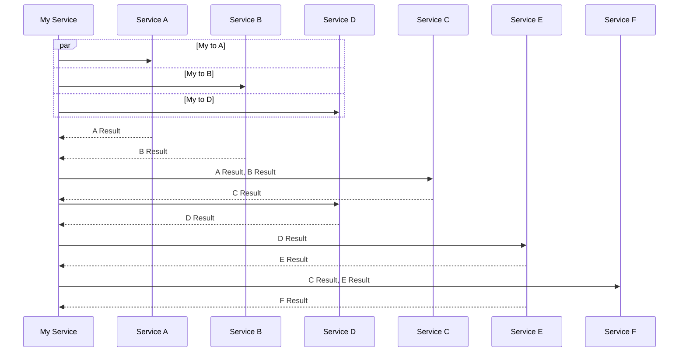

# async-task-orchestrator-generator


[](https://github.com/sponsors/CodingFlow)

C# source generator for executing dependent async tasks optimally and easily.

Orchestrating multiple asynchronous operations in C# can be challenging,
especially when optimizing for parallel execution of I/O tasks such as REST API
service calls to microservices.
The optimization challenge is even greater when the operations have dependencies on
each other.

This source generator simplifies the implementation by enabling developers
to easily define the relationship between async tasks via their inputs and outputs.
This generator then uses the specification provided by the developer to generates
optimal code that maximizes parallel execution of the tasks from an I/O standpoint.
This includes immediately handling tasks as they complete.

## Requirements

The generated code uses features from .NET 9.

## Motivation Example

Here is a sequence diagram representing an example orchestration of API calls
to multiple services, where some calls depend on the results of others:



As shown in the diagram, calls to A, B, and D can be called in parallel. Once both
A and B complete, C can be called with the responses from A and B. When D returns,
E can be called. Once both C and E return their responses, F can finally be
called with the responses from C and E.

Beginning to try to implement this in C#:

```c#
var taskA = a.CallA();
var taskB = b.CallB();
var taskD = d.CallD();

await Task.WhenAll(taskA, taskB);

var resultA = taskA.Result;
var resultB = taskB.Result;

var taskC = c.CallC(resultA, resultB);

var resultD = await taskD;

var taskE = e.CallE(resultD);

await Task.WhenAll(taskC, taskE);

return await f.CallF(taskC.Result, taskD.Result);
```

While the above code works, it is not optimal from an I/O perspective. D could complete
before A and B while they are being awaited. In this case, E cannot be called until
A and B complete, even though D has already completed.

A more complex implementation is needed to handle tasks as they complete. It is
feasible, but as you'll see in the next section, this source generator can greatly
simplify the implementation.

## Using the Source Generator

Create a specification class, decorated with the `AsyncTaskOrchestrator` attribute, that defines the async tasks to be orchestrated.
This spec is a [domain specific language](https://en.wikipedia.org/wiki/Domain-specific_language)
(DSL) within C# that specifies task dependencies via which task outputs should be used as inputs
to other tasks.

```c#
using AsyncTaskOrchestratorGenerator;

namespace TestLibrary;

[AsyncTaskOrchestrator]
internal class OrchestratorSpec
{
    private readonly A a;
    private readonly B b;
    private readonly C c;
    private readonly D d;
    private readonly E e;
    private readonly F f;

    public OrchestratorSpec(A a, B b, C c, D d, E e, F f)
    {
        this.a = a;
        this.b = b;
        this.c = c;
        this.d = d;
        this.e = e;
        this.f = f;
    }

    public Task<int> Spec()
    {
        var resultA = a.CallA(); 
        var resultB = b.CallB();
        var resultC = c.CallC(resultA.Result, resultB.Result);
        var resultD = d.CallD(); 
        var resultE = e.CallE(resultD.Result);
        return f.CallF(resultC.Result, resultE.Result);
    }
}

```

Notice that the call to D is specified after the call to C. This will not affect
the execution order optimization. In other words, as long as the code compiles,
the call order does not matter (which means one less thing to worry about!).

Also take note that there is no need to manage `await` calls or figuring out which
`Task.*` method to call.

The source generator will generate an orchestrator class based on the spec provided
in the same namespace. The class name and the method name can be specified in the
attribute's parameters. The default class name is `Orchestrator` and the default method name
is `Execute`.

Example usage of the generated orchestrator:

```c#
var a = new A();
var b = new B();
var c = new C();
var d = new D();
var e = new E();
var f = new F();

var orchestrator = new Orchestrator(a, b, c, d, e, f);

var result = await orchestrator.Execute();
```